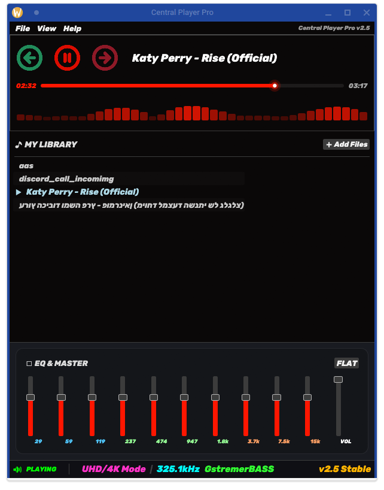

# 🎵 Central Player Pro — v2.5

נגן מוזיקה **מקצועי ומתקדם** כתוב ב-Rust + egui.  
מנוע אודיו מבוסס GStreamer עם EQ מקצועי, ספרייה חכמה, ותמיכה ב-UHD/4K Audio.



---

## ✨ פיצ'רים

| פיצ'ר | פירוט |
|-------|-------|
| 🔥 GStreamer Engine | מנוע אודיו native — יציב ומהיר |
| 🎚️ EQ 10 Bands | אקולייזר מקצועי עם presets |
| 📻 UHD/4K Mode | תמיכה עד 325.1kHz |
| 🎨 Theme Manager | ערכות צבעים מותאמות אישית |
| 📚 ספרייה חכמה | ניהול מוזיקה מלא |
| 🎵 Playlist | רשימות השמעה מתקדמות |
| 📊 Spectrum Analyzer | ויזואליזציה חלקה בזמן אמת |
| ⚡ Native UI | egui — ללא web bloat, מהיר לגמרי |
| 🔄 Resume | זוכר מיקום בשיר |
| 🖥️ Cross-platform | Linux / Windows |

---

## 🏗️ ארכיטקטורה

```
Central Player Pro
├── main.rs            ← Entry point + egui app loop
├── audio_engine.rs    ← GStreamer pipeline + command bus
├── equalizer.rs       ← 10-band EQ + presets
├── playlist.rs        ← ניהול רשימות השמעה
├── app_state.rs       ← State management מרכזי
├── components.rs      ← UI components — progress, spectrum
├── theme_manager.rs   ← ערכות צבעים דינמיות
└── color_config.rs    ← הגדרות צבע גלובליות
```

### מנוע האודיו
```
GStreamer Pipeline:
playbin → audio-filter → equalizer-10bands → autoaudiosink
                              ↑
                         SetEq commands
                         via mpsc channel
```

### תקשורת Threads
```
UI Thread  ──cmd──→  Audio Thread (GStreamer)
           ←event──  StateChanged / PositionUpdated / EOS
```

---

## ⚡ בנייה

### דרישות

```bash
# Fedora
sudo dnf install gstreamer1-devel gstreamer1-plugins-base-devel \
                 gstreamer1-plugins-good gstreamer1-plugins-bad-free

# Ubuntu / Mint
sudo apt install libgstreamer1.0-dev libgstreamer-plugins-base1.0-dev \
                 gstreamer1.0-plugins-good gstreamer1.0-plugins-bad
```

### התקנת audiobass
```bash
sudo rpm -i audiobass-0.1.0-1.x86_64.rpm   # Fedora
```

### בנייה
```bash
git clone https://github.com/56tytt/Central-Player-Pro
cd Central-Player-Pro
cargo build --release
./target/release/central-player
```

---

## 🎚️ EQ — אקולייזר

10 bands מקצועיים:

| Band | תדר | שימוש |
|------|-----|-------|
| 1 | 29 Hz | Sub-bass עמוק |
| 2 | 59 Hz | Bass |
| 3 | 119 Hz | Upper bass |
| 4 | 237 Hz | Low-mid |
| 5 | 474 Hz | Mid |
| 6 | 947 Hz | Upper-mid |
| 7 | 1.8 kHz | Presence |
| 8 | 3.7 kHz | Brilliance |
| 9 | 7.5 kHz | Air |
| 10 | 15 kHz | Ultra-high |

טווח: **-24dB עד +12dB** לכל band  
VOL Master: **0–100%** עצמאי מה-EQ

---

## 🎨 Themes

ניהול ערכות צבעים דינמי דרך `theme_manager.rs`:
- ערכות מובנות
- צבעים מותאמים אישית דרך `color_config.rs`
- שינוי theme בזמן ריצה

---

## 📊 Spectrum Analyzer

ויזואליזציה של 40 bands בזמן אמת:
- Smooth animation עם weighted average
- Fade-out הדרגתי כשהשיר עוצר
- מחושב בנפרד מה-audio thread

---

## 🔧 Stack טכני

| רכיב | טכנולוגיה |
|------|-----------|
| שפה | Rust 🦀 |
| UI | egui (immediate mode) |
| אודיו | GStreamer + gst-rs |
| Bass Engine | audiobass |
| Threading | std::thread + mpsc channels |
| State | Arc\<Mutex\<T\>\> |

---

## 🗺️ Roadmap

- [ ] Last.fm scrobbling
- [ ] Lyrics display
- [ ] MPRIS2 support (media keys)
- [ ] Mini player mode
- [ ] Audio visualizer 3D
- [ ] ICED / Slint UI variant

---

## 📜 רישיון

MIT — קוד פתוח, לטובת הקהילה. 🦀
